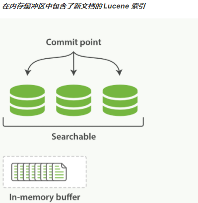

## 基本概念

Elasticsearch 是什么？

​		分布式、RESTful 风格的搜索和数据分析引擎


- Index索引：具有相似特性的文档集合，类比数据库表
- Document文档：相当于SQL里的一行记录
- Field字段：相当于SQL里的一个字段
- Shard分片：一个索引可切分为多个shard，分布在不同机器节点。每个shard都是一个lucene index
- Replica shard副本分片： shard故障备用，提升搜索吞吐量和性能
- Mapping映射：定义索引中字段的类型和索引设置【不设置的话，会保存但是不能用于搜索】


## 基本操作

kibana操作：http://10.248.33.26:30601/app/kibana#/dev_tools/console?_g=()

#### 索引操作

增加索引：

```
PUT testq
{
    "mappings" : {
      "dynamic" : "false",  //未设置类型的字段是否自动设置
      "properties" : {
        "id" : {
          "type" : "keyword"
        },
        "qid" : {
          "type" : "long"
        },
        "question" : {
          "type" : "text",
          "fields" : {
            "keyword" : {
              "type" : "keyword",
              "ignore_above" : 256
            }
          }
        }
    },
    "settings": {
      "index": {
        "number_of_shards" : "3"	//分片数量
      }
    }
}
```

查询索引：

```
GET test_index/_mapping
GET test_index
```

```
GET _cat/indices/testq?v
health status index uuid                   pri rep docs.count docs.deleted store.size pri.store.size
yellow open   testq SLCsRtLPQJSx6WG7SQ6zwg   3   1          0            0       690b           690b
```

修改索引

```
//增加字段类型，允许
PUT testq/_mapping
{
  "properties": {
    "update_time": {
      "type": "date"
    }
  }
}

//修改字段类型，不允许
PUT test_index/_mapping
{
  "properties": {
    "create_time": {
      "type": "keyword"
    }
  }
}
```

删除索引：

```
DELETE test_index
```

注意点：

- 索引mapping设置：指定用于搜索的字段类型，不搜索可不设置

- 如果原来已有数据，新增索引字段后，根据此字段取索引老数据，是不会生效的【为什么？？】

  

#### 文档操作

写入新文档：

```
POST testq/_doc/5639bf1b89bc4603d5c612d9
{
  "create_time" : "2015-11-04T08:17:31.343Z",
  "id" : "5639bf1b89bc4603d5c612d9",
  "qid" : 7,
  "question" : "是否有满足某条件的商品",
  "subcategory_id" : "5639bf1a89bc4603d5c61260",
  "update_time" : "2017-08-29T09:16:12.997Z"
}
```

查询新文档：

```
GET testq/_doc/5639bf1b89bc4603d5c612d9
{
  "_index" : "testq",
  "_type" : "_doc",
  "_id" : "5639bf1b89bc4603d5c612d9",
  "_version" : 1,
  "_seq_no" : 0,
  "_primary_term" : 1,
  "found" : true,
  "_source" : {
    "create_time" : "2015-11-04T08:17:31.343Z",   //上面索引设置中，没有此字段，但仍然有存储
    "id" : "5639bf1b89bc4603d5c612d9",
    "qid" : 7,
    "question" : "是否有满足某条件的商品",
    "subcategory_id" : "5639bf1a89bc4603d5c61260",
    "update_time" : "2017-08-29T09:16:12.997Z"
  }
}
```

修改文档：

```
POST testq/_doc/5639bf1b89bc4603d5c612d9
{
  "create_time" : "2015-11-04T08:17:31.343Z",
  "id" : "5639bf1b89bc4603d5c612d9",
  "qid" : 10,
  "question" : "是否有满足某条件的商品",
  "subcategory_id" : "5639bf1a89bc4603d5c61260",
  "update_time" : "2017-08-29T09:16:12.997Z"
}
```

删除文档：

```
DELETE testq/_doc/5639bf1b89bc4603d5c612d9
```

注意点：

- 修改文档：实际是分为删除文档和重新写入文档


####  搜索操作

```
GET testq/_search
{
  "query": {
    "match": {
      "question": {
        "query": "商品"
      }
    }
  }
}

{
  "took" : 0,
  "timed_out" : false,
  "_shards" : {
    "total" : 3,
    "successful" : 3,
    "skipped" : 0,
    "failed" : 0
  },
  "hits" : {
    "total" : {
      "value" : 1,
      "relation" : "eq"
    },
    "max_score" : 0.26706278,
    "hits" : [
      {
        "_index" : "testq",
        "_type" : "_doc",
        "_id" : "5639bf1b89bc4603d5c612d9",
        "_score" : 0.26706278,
        "_source" : {
          "create_time" : "2015-11-04T08:17:31.343Z",
          "id" : "5639bf1b89bc4603d5c612d9",
          "qid" : 10,
          "question" : "是否有满足某条件的商品",
          "subcategory_id" : "5639bf1a89bc4603d5c61260",
          "update_time" : "2017-08-29T09:16:12.997Z"
        }
      }
    ]
  }
}
```


#### 聚合操作

max、min、avg等等：

```
GET testq/_search
{
   "size" : 0,
   "aggs": {
      "avg_qid": { 
         "avg": {
            "field": "qid" 
         }
      }
   }
}

  "aggregations" : {
    "avg_qid" : {
      "value" : 15.0
    }
  }
```

分组操作（分桶）：

```
GET testq/_search
{
  "size":0, 
  "aggs": {
    "qid_group": {
      "terms": { "field": "qid" }
    }
  }
}

  "aggregations" : {
    "qid_group" : {
      "doc_count_error_upper_bound" : 0,
      "sum_other_doc_count" : 0,
      "buckets" : [
        {
          "key" : 10,
          "doc_count" : 1
        },
        {
          "key" : 20,
          "doc_count" : 1
        }
      ]
    }
  }
```


## 业务使用实例


#### 搜索高亮和排序


#### 字段组合查询

```
question_id: id1, conds_md5: cond1
question_id: id1, conds_md5: cond2
question_id: id2, conds_md5: cond3

indices.query.bool.max_clause_count：bool查询有最大项目限制，默认为1024，是静态配置，就算增加，也比较慢

新增一个字段：question_md5: id1.cond1, 查询的时候用terms来查询，这是查询最大限制受index.max_terms_count控制，且速度更快。
```

1000个左右时：测试环境


#### 分组聚合排序

功能：全局搜索下，按条件聚合展示


- 展示按问题分组，每个问题下面按conds_md5字段（即同样的条件）分组
- 条件的更新时间：取值于条件下所有回复的最新更新时间
- 问题下只展示最新的一个条件，并且需展示总条件数
- 条件下只展示最新的两条回复，并且需展示总回复数

以前方式：

1. 从es中获取店铺这一批问题下，所有的回复记录
2. 内存中，使用分组和排序，分别计算每个问题条件数、回复数
3. 如果店铺回复数过多，会导致响应慢超时，上万回复数时会耗时20s左右。

现在方式：使用es来进行分组排序，大数据量下响应稳定在400ms以下

```json
{
	"query": {},
	"aggregations": {
		"question_id_agg": { //按问题聚合
			"terms": {  //指定按 question_id 分组，返回20个问题的数据
				"field": "question_id",
				"size": 20
			},
			"aggregations": { //子聚合，即条件聚合
				"conds_md5_agg": {  //子聚合1， 取到conds_md5组内中最大的update_time，来对所有conds_md5排序，取前一个。
					"aggregations": {
						"max_update_time": {
							"max": {
								"field": "update_time"
							}
						}
					},
					"terms": {
						"field": "conds_md5",
						"order": [{
							"max_update_time": "desc"
						}],
						"size": 1
					}
				},
				"distinct_md5": {  //子聚合2，获取一个问题下不同的conds_md5个数（即基数）
					"cardinality": {
						"field": "conds_md5",
						"precision_threshold": 40000
					}
				}
			}
		}
	}
}
```


## 集群读写流程

几个基本概念

- 集群Master节点：管理集群范围的变更，例如创建或删除索引、添加或删除节点
- 请求可发到集群任一节点，根据路由转发到实际节点
- 如何负载均衡：轮询所有节点【客户端是否可像redis缓存路由信息，减少转发？？？】
- 如何路由：shard = hash(routing)%index_primary_shard_number
- routing是啥：默认是_id，可根据业务情况制定，比如shop_id

#### 写流程

 	

1. 客户端向 Node 1 发送插入一条文档

2. Node 1根据 _id 计算路由应该写到分片 0 ，转发Node 3处理

3. Node 3 在主分片上面执行请求，并转发到 Node 1 和 Node 2 的副本分片上
4. 返回给Node 1，Node 1返回给客户端


#### 读流程


1. 客户端向 Node 1 发送获取请求
2. Node 1根据 _id 计算路由应该读分片 0， 分片 0 的存在于三个节点上，转发到任意节点，这里是Node 2
3. Node 2 将文档返回给 Node 1 ，Node 1返回给客户端


#### 更新流程


1. 客户端向 Node 1 发送更新请求
2. 路由转发到主分片所在的 Node 3 
3. Node 3 从主分片检索文档，修改后重新写入一条文档，将老文档标记为删除 
4. 更新文档后，同步到其他副本分片
5. Node 3返回给Node 1，Node 1返回到客户端
   

## 搜索原理

#### 倒排索引

- doc1：the brown dog
- doc2：the black dog

正向索引：


倒排索引:


如何设置分词：[官网分词器介绍](https://www.elastic.co/guide/en/elasticsearch/reference/current/analysis-tokenizers.html#analysis-tokenizers)

#### 文档刷新



- 文档首先写入内存中，此时可获取但不可搜索
- 默认每隔1s 从内存refresh到新段segment中，然后可搜索
- 刷新有性能消耗，不需要高实时性，时间可以设置长一点

```
PUT question_b/_settings
{
	"index": {
		//"refresh_interval": "30s" //全力同步数据时
		"refresh_interval": "1s" //默认
	}
}
```


#### 文档刷新和刷写


